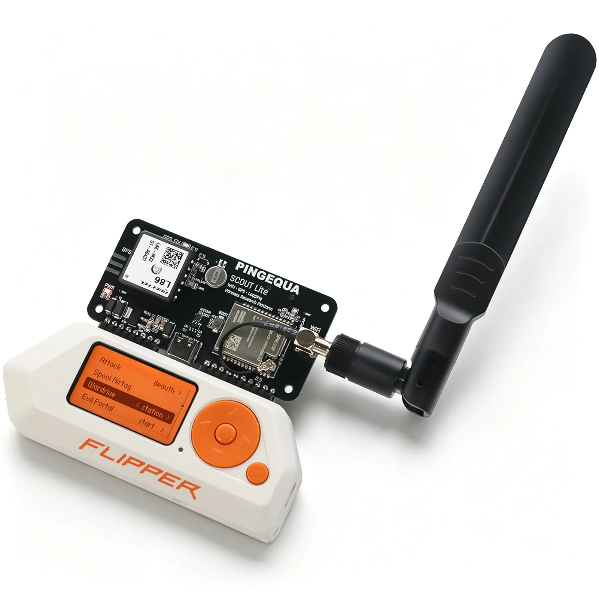
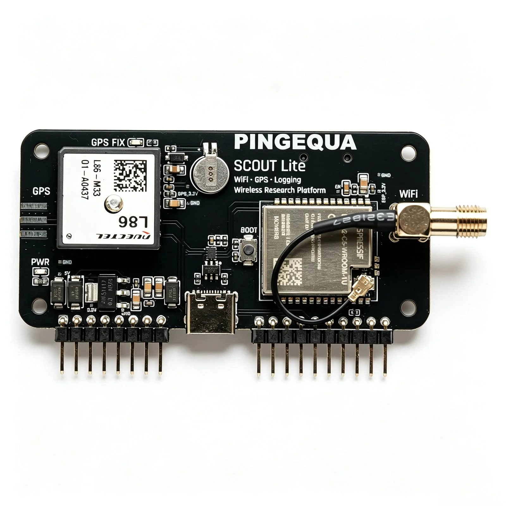
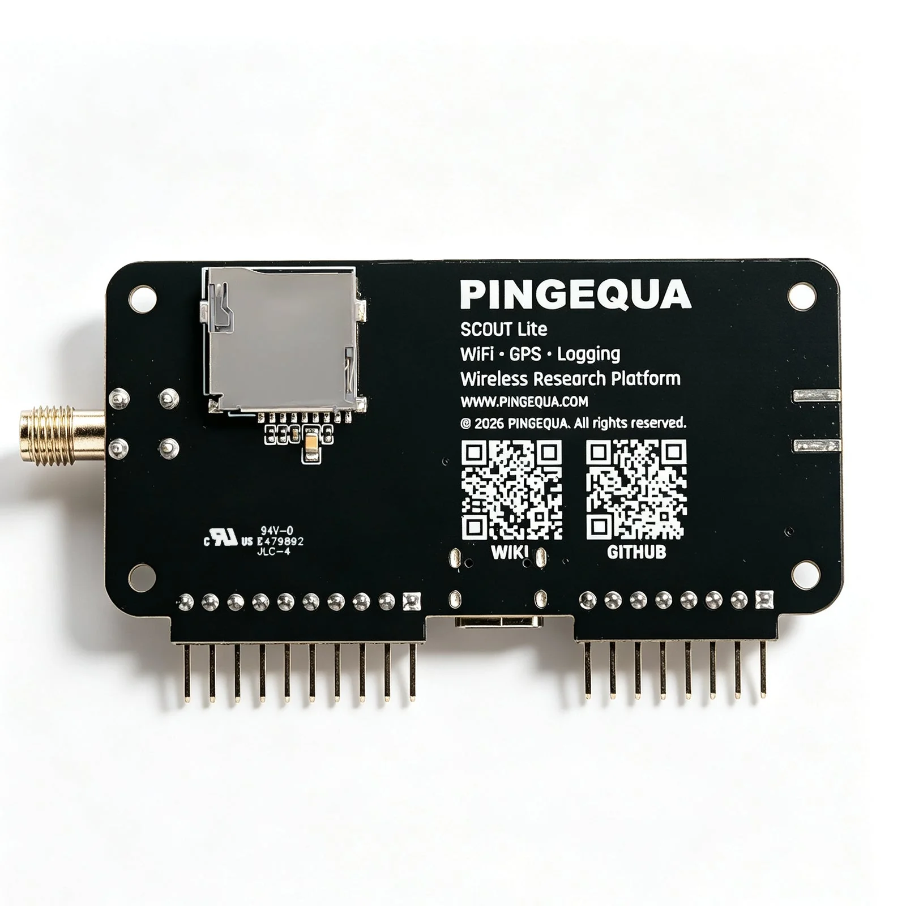
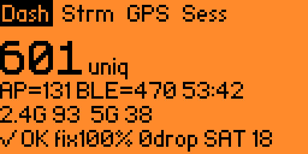

# Scout Lite for Flipper Zero: ESP32-C5 Wi-Fi research and GPS wardriving

Scout Lite is a Flipper Zero companion board with an **ESP32-C5 2.4/5 GHz Wi-Fi radio, onboard L86-M33 GNSS, and its own microSD slot**. It ships with **ESP32 Marauder**. Marauder is the primary, recommended firmware for Wi-Fi research; start with its Flipper companion app. For a more focused wardriving screen, try the **SigRoam Flipper app (FAP)**. If you also want sealed survey logs and an automatic WiGLE upload *attempt after STOP*, switch the board to the optional **SigRoam scanner firmware**.

  

  <a href="https://www.pingequa.com/products/scout-lite">Product page</a> ·
  <a href="https://flash.pingequa.com/devices/scout-lite">Web Flasher</a> ·
  <a href="https://github.com/pingequalab/sigroam-wardriving/releases/latest">SigRoam FAP releases</a>

> For network research, education, and assessments of networks you own or are authorized to test. The Flipper Zero and FAT32 microSD card are separate; the board and dual-band antenna are included.

## Choose your software

**Start with the factory Marauder setup.** The same Scout Lite hardware supports these three paths:

| Your goal | Firmware on Scout Lite | App on Flipper Zero | Logging and upload |
| --- | --- | --- | --- |
| **Wi-Fi research and the broad Marauder toolkit — recommended first** | Factory **ESP32 Marauder** | **Marauder companion app** | Marauder Wardrive CSV on Scout Lite microSD; Marauder direct upload or manual card transfer. No board flash needed. |
| **A focused wardriving display without reflashing** | Factory **ESP32 Marauder** | **SigRoam Wardriving FAP** | SigRoam controls Marauder over its serial protocol. Logs and uploads still follow **Marauder's** workflow. |
| **Complete SigRoam survey and upload workflow** | Optional **SigRoam scanner firmware** | Matching **SigRoam Wardriving FAP** | Sealed CSV on Scout Lite microSD; upload attempt after successful STOP when configured Wi-Fi is reachable, with manual retry. |

The FAP runs on the **Flipper Zero**. The Marauder or SigRoam scanner firmware runs on the **Scout Lite ESP32-C5**. The Flipper controls and displays the session; Scout Lite scans, reads GNSS, and writes to its own microSD. Installing a SigRoam FAP alone does **not** install SigRoam scanner firmware or enable its after-STOP upload.

**Marauder compatibility:** Scout Lite supports its published ESP32-C5 Marauder image as a first-class firmware choice, including recovery through the [Web Flasher](https://flash.pingequa.com/devices/scout-lite). The SigRoam FAP speaks the Marauder serial protocol. Individual Marauder functions depend on the ESP32-C5 build and fitted hardware: Scout Lite has no CC1101 or nRF24 radio, and **5 GHz is for scan/enumeration, not handshake capture**. Compatibility does not imply that every function from every other Marauder board exists here.

## Hardware and package contents

| Part | Scout Lite configuration |
| --- | --- |
| Wi-Fi | ESP32-C5-WROOM-1U; one radio scans 2.4 GHz and 5 GHz, switching between bands rather than scanning both simultaneously. |
| GNSS | Onboard Quectel L86-M33 with integrated patch antenna; its data goes to the ESP32-C5 and is also routed to Flipper GPIO 15/16 for a separately configured native GPS app. |
| Storage | Onboard microSD slot for WigleWifi CSV. Use a FAT32 card; **card not included**. |
| Antenna | SMA connector and included dual-band 2.4/5 GHz Wi-Fi antenna. Attach the antenna before powering the board. |
| Connections | Flipper Zero GPIO header for power/control; USB-C for power and firmware flashing. |
| Firmware | ESP32 Marauder pre-flashed; optional SigRoam scanner firmware in the browser flasher. |

<table>
  <tr>
    <td align="center"> Front: GNSS, ESP32-C5, USB-C and antenna connector</td>
    <td align="center"> Back: Scout Lite microSD slot and GPIO pins</td>
  </tr>
</table>

Scout Lite is a Wi-Fi, GNSS, and logging board. It does not add a Wi-Fi radio to the Flipper itself. The documented workflow uses a Flipper Zero host.

## Get started with Marauder (recommended)

1. Attach the included dual-band antenna. Insert a **FAT32 microSD card into Scout Lite** if you want logs; it is different from the Flipper SD card.
2. Seat Scout Lite on the Flipper Zero GPIO header. The board ships with Marauder, so **no board flash is needed for the first run**.
3. Open a compatible **Marauder companion app** on the Flipper. On Momentum, the path is **Apps → GPIO → [ESP32] WiFi Marauder**. Find app and Flipper firmware instructions in the [ESP32 Marauder project](https://github.com/justcallmekoko/ESP32Marauder) and your [Flipper firmware distribution](https://momentum-fw.dev/).
4. Start with a normal scan to confirm communication. Choose **Wardrive** for GPS-tagged logs, and verify a GNSS fix outdoors before relying on coordinates.
5. Stop the session and read the WigleWifi CSV from the **Scout Lite microSD**. Marauder also provides [direct WiGLE upload](https://github.com/justcallmekoko/ESP32Marauder/wiki/wardriving-direct-upload); it is separate from SigRoam's after-STOP workflow.

Marauder is the first recommendation for its wider Wi-Fi and Bluetooth research menus. Feature availability follows the Scout Lite ESP32-C5 image. The [official Marauder Wardrive guide](https://github.com/justcallmekoko/ESP32Marauder/wiki/Wardrive) explains how its GPS-gated logging works.

## Try the SigRoam FAP for wardriving

[SigRoam Wardriving](https://github.com/pingequalab/sigroam-wardriving) is a dedicated Flipper field display. Its **Dash / Strm / GPS / Sess** views present AP/BLE observations, GNSS fix, and session status. It can control the factory Marauder image through Marauder's serial protocol, so you can try the FAP **without changing board firmware**. Some SigRoam capture and upload indicators require the matching SigRoam scanner firmware.

   
  SigRoam dashboard · screenshot from the <a href="https://github.com/pingequalab/sigroam-wardriving">SigRoam Wardriving project</a>

1. Download the FAP that matches your Flipper firmware from [SigRoam Releases](https://github.com/pingequalab/sigroam-wardriving/releases/latest). Copy it to **SD Card/apps/GPIO/** on the **Flipper**.
2. Set **Settings → System → Log Device → Off** to free the serial pins, then open **Apps → GPIO → SigRoam Wardriving**.
3. Use **Probe firmware** if the board does not respond. In **Dashboard**, press **OK** to start and **OK** again to stop; **Back** only leaves the dashboard.
4. With the factory Marauder image, use **Marauder's** logging and upload procedure. The FAP alone does not create a SigRoam sealed session.

The [SigRoam firmware comparison](https://github.com/pingequalab/sigroam-wardriving#choose-your-scanner-firmware) describes these two board-firmware combinations.

## Optional: complete SigRoam scanner workflow

Choose this when wardriving is your main task and you want SigRoam's session health views, sealed logs, and WiGLE upload attempt after STOP. SigRoam survey capture is passive: it does not provide deauthentication, handshake capture, or attack traffic. Later upload uses a normal Wi-Fi/HTTPS connection.

1. Disconnect Scout Lite from the Flipper. In a supported browser, open the [Scout Lite Web Flasher](https://flash.pingequa.com/devices/scout-lite), choose **SigRoam**, and follow its **BOOT / USB-C download-mode** steps. The picker handles the two firmware layouts.
2. Install the **matching SigRoam FAP** from [Releases](https://github.com/pingequalab/sigroam-wardriving/releases/latest) on the Flipper. Check release notes for Official/Momentum versus Unleashed builds and API compatibility. Never flash a FAP to the ESP32-C5.
3. Insert a FAT32 microSD card in **Scout Lite**. For WiGLE upload, put these four plain-text files at that card's root; each file contains only its value:

   | File | Value |
   | --- | --- |
   | **wigle_api_name.txt** | WiGLE API Name |
   | **wigle_api_token.txt** | WiGLE API Token |
   | **home_ssid.txt** | Upload Wi-Fi network name |
   | **home_psk.txt** | Upload Wi-Fi password; empty file for an open network |

4. Restart Scout Lite to import the values. The scanner consumes the source files. Check that they disappear and that **Upload** on the FAP shows **Key** and **Home** configured. Keep the credentials private.
5. Start a survey from **Dash**, then press **OK** to stop it. Successful STOP seals and verifies the CSV. If the configured Wi-Fi is reachable, Scout Lite **attempts** to upload pending sealed files. Failed files remain on Scout Lite microSD for retry from **Upload**. **Uploaded** with a WiGLE **transId** means WiGLE accepted a file; later processing is separate. The scanner neither interrupts an active survey to upload nor automatically retries simply because Wi-Fi later returns.

   
  SigRoam Upload view · screenshot from the <a href="https://github.com/pingequalab/sigroam-wardriving">SigRoam Wardriving project</a>

See the [SigRoam scanner firmware](https://github.com/pingequalab/sigroam-firmware) and [FAP upload setup](https://github.com/pingequalab/sigroam-wardriving#setup-automatic-wigle-upload) for release-specific details. To return to Marauder, select **Marauder** in the same [Web Flasher](https://flash.pingequa.com/devices/scout-lite).

## GPS, storage, and WiGLE: common distinctions

- **Two SD cards:** Scout Lite's microSD holds its survey logs. The Flipper SD card holds FAP apps and Flipper settings. Put scanner upload credential files on the **Scout Lite** card.
- **Board GNSS versus native Flipper GPS:** Marauder and SigRoam read Scout Lite's onboard GNSS directly. The native GPS app needs NMEA mapped to **Flipper GPIO 15/16**. On Momentum, use **MNTM → Protocols → GPIO Pins → NMEA GPS UART → Extra 15,16**. This mapping is not needed for board-side wardriving.
- **No fix versus no scan:** A normal scan can find APs while GPS-tagged Wardrive rows are absent. Test outdoors and wait for a valid fix. The [Marauder Wardrive guide](https://github.com/justcallmekoko/ESP32Marauder/wiki/Wardrive) says rows are saved only with a valid fix.
- **Manual upload:** With either board firmware, power down, remove Scout Lite's microSD, and upload a compatible WigleWifi CSV through [WiGLE](https://wigle.net/). Factory Marauder has its own [direct upload](https://github.com/justcallmekoko/ESP32Marauder/wiki/wardriving-direct-upload); SigRoam scanner firmware offers the configured after-STOP attempt.

## Troubleshooting

Work from the observable symptom before reflashing.

| Symptom | First check | Next step |
| --- | --- | --- |
| Flipper app cannot find Scout Lite, or serial is busy | Reseat the board, verify power and the chosen app, and set **Settings → System → Log Device → Off**. | Run **Probe firmware** in SigRoam; check [FAP compatibility](https://github.com/pingequalab/sigroam-wardriving#compatibility-and-limits). |
| Scan works, but no WigleWifi CSV appears | Confirm a FAT32 card is in **Scout Lite**, not only the Flipper. Start **Wardrive**, not plain Scan. | Check for a valid GNSS fix outdoors; see [Marauder Wardrive](https://github.com/justcallmekoko/ESP32Marauder/wiki/Wardrive). |
| Board GPS works, but the native Flipper GPS app has no data | Native GPS uses the separate GPIO 15/16 NMEA path. | Configure the compatible firmware's GPS UART mapping; on Momentum use **Extra 15,16**. |
| SigRoam shows **Key** or **Home** unconfigured | Check the four credential file names and contents on the **Scout Lite** card, then restart the scanner. | Follow the [SigRoam upload guide](https://github.com/pingequalab/sigroam-wardriving#setup-automatic-wigle-upload). |
| SigRoam stopped, but upload did not finish | Check **Upload** for Wi-Fi, queue state, and WiGLE response; keep board and card powered. | Retry pending sealed files from **Upload** in range. WiGLE **HTTP 429** is a limit response, not a completed upload. |
| Web Flasher sees no board | Use a supported browser and USB-C **data** cable; disconnect the Flipper. | Follow [download mode](https://flash.pingequa.com/devices/scout-lite): hold **BOOT**, plug in USB-C, release BOOT, then connect. |
| Wrong app behavior after a firmware switch | Confirm the image chosen in Web Flasher and matching FAP on Flipper. | Reinstall the intended **Marauder** or **SigRoam** choice in the flasher; do not mix raw binary offsets. |

## Frequently asked questions

### Does Scout Lite ship with Marauder or SigRoam?

It ships **pre-flashed with ESP32 Marauder**. Marauder plus its Flipper companion app is the recommended first setup for Wi-Fi research. SigRoam is optional: its FAP can be tried with factory Marauder; its scanner firmware is a separate board flash for the full survey workflow.

### Is Scout Lite fully compatible with ESP32 Marauder?

Scout Lite is designed for and ships with the **Scout Lite ESP32-C5 Marauder image**, and that image can be restored from the official Web Flasher. Marauder is the primary firmware choice. Feature availability follows the ESP32-C5 target and fitted hardware. The board scans 5 GHz APs but does not capture 5 GHz handshakes, and it has no CC1101 or nRF24 radio.

### Which setup is best for wardriving?

Start with **Marauder + Marauder companion** for the wider toolkit. Try **Marauder + SigRoam FAP** for the dedicated field display without reflashing. Use **SigRoam scanner firmware + matching FAP** for sealed survey records and the configured upload attempt after STOP.

### Where are logs and upload credentials stored?

On the **Scout Lite microSD**, not the Flipper's SD card. Marauder and SigRoam have different logging/upload workflows; installing the SigRoam FAP does not convert Marauder logs into SigRoam sealed sessions.

### Can I switch back to Marauder?

Yes. Disconnect Scout Lite from the Flipper, choose **Marauder** in the [Scout Lite Web Flasher](https://flash.pingequa.com/devices/scout-lite), and follow its instructions. Use current flasher/release notes rather than old hard-coded binary offsets.

## Project references and current releases

| Resource | Use it for |
| --- | --- |
| [Scout Lite product page](https://www.pingequa.com/products/scout-lite) | Hardware photos, package contents and current commerce details. |
| [Scout Lite Web Flasher](https://flash.pingequa.com/devices/scout-lite) | Marauder/SigRoam image choice, supported browsers, BOOT sequence and recovery. |
| [ESP32 Marauder](https://github.com/justcallmekoko/ESP32Marauder) · [Wardrive](https://github.com/justcallmekoko/ESP32Marauder/wiki/Wardrive) · [direct upload](https://github.com/justcallmekoko/ESP32Marauder/wiki/wardriving-direct-upload) | Marauder features, GPS-gated logging and its own WiGLE workflow. |
| [SigRoam Wardriving FAP](https://github.com/pingequalab/sigroam-wardriving) · [latest FAP release](https://github.com/pingequalab/sigroam-wardriving/releases/latest) | FAP behavior, supported combinations, screenshots and compatible assets. |
| [SigRoam scanner firmware](https://github.com/pingequalab/sigroam-firmware) · [scanner releases](https://github.com/pingequalab/sigroam-firmware/releases) | Optional ESP32-C5 image and release-specific notes. |
| [PINGEQUA wardriving comparison](https://www.pingequa.com/blogs/guides-tutorials/flipper-zero-esp32-gps-wardriver-sigroam-marauder) · [Press & Media Kit](https://www.pingequa.com/pages/press-media-kit) | Related hardware/software context and first-party media. |

Hardware photos in **assets/** come from the [PINGEQUA Scout Lite product gallery](https://www.pingequa.com/products/scout-lite); SigRoam screens come from the [SigRoam Wardriving repository](https://github.com/pingequalab/sigroam-wardriving/tree/main/screenshots). Credit: PINGEQUA.

**Radio and software note:** Follow local radio rules, including applicable FCC Part 15, SDoC/FCC ID or regional equipment requirements for the final hardware and antenna configuration. ESP32 Marauder is a third-party project; the SigRoam FAP is a separate PINGEQUA project. Compatibility does not imply affiliation with Flipper Devices or the Marauder maintainers.
